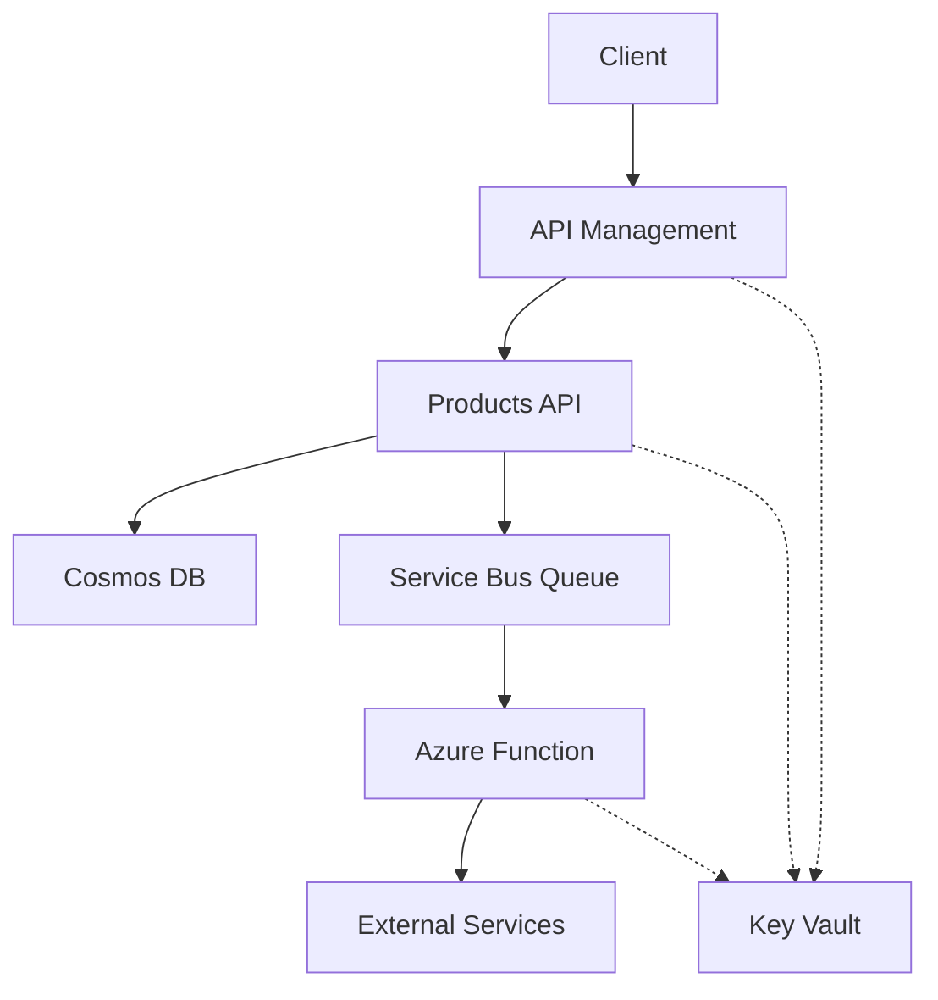

# Cloud API Solution

## Overview

A modern cloud-native application demonstrating enterprise-grade architecture using Azure services and .NET 9. This solution implements API Gateway patterns, event-driven architecture, and Infrastructure as Code (IaC).

## Architecture



## Features

### API Gateway (Azure API Management)
- OAuth 2.0 authentication
- Rate limiting & throttling policies
- Request/response transformation
- Azure Key Vault integration
- Swagger/OpenAPI documentation

### Products API (.NET 9)
- Clean Architecture design
- Cosmos DB integration
- CRUD operations with partition keys
- Comprehensive error handling
- Async/await best practices

### Event-Driven Notification System
- Azure Functions (.NET 9 Isolated)
- Service Bus Queue integration
- Dead Letter Queue handling
- Retry policies
- Application Insights telemetry

### DevOps & Infrastructure
- Bicep templates for Azure resources
- GitHub Actions CI/CD pipeline
- Managed Identity integration
- Application monitoring
- Environment configuration

## Project Structure

```
CloudApiSolution/
├── src/
│   ├── ApiGateway/          # APIM policies and configurations
│   ├── Products.Api/        # Main REST API application
│   └── NotificationFunction/# Azure Function app
├── infrastructure/          # IaC templates
│   ├── main.bicep
│   └── modules/
├── .github/
│   └── workflows/          # CI/CD pipeline definitions
├── tests/                  # Unit & integration tests
├── monitoring/             # Dashboards & queries
├── global.json            # .NET version configuration
└── README.md
```

## Prerequisites

- .NET 9 SDK
- Azure CLI
- Azure Functions Core Tools v4
- Visual Studio Code
- Docker Desktop (optional)

## Getting Started

1. **Clone the Repository**
```bash
git clone https://github.com/yourusername/cloud-api-solution.git
cd cloud-api-solution
```

2. **Install Dependencies**
```bash
dotnet restore
```

3. **Configure Local Settings**
```bash
cp src/Products.Api/appsettings.example.json src/Products.Api/appsettings.Development.json
cp src/NotificationFunction/local.settings.example.json src/NotificationFunction/local.settings.json
```

4. **Deploy Azure Resources**
```bash
az login
az deployment group create \
    --resource-group your-rg \
    --template-file infrastructure/main.bicep \
    --parameters @infrastructure/main.parameters.json
```

5. **Run the Solution Locally**
```bash
# Run Products API
cd src/Products.Api
dotnet run

# Run Function App (in new terminal)
cd src/NotificationFunction
func start
```

## Deployment

### Configure GitHub Actions

1. Add required secrets to your GitHub repository:
   - `AZURE_CREDENTIALS`
   - `AZURE_RG`
   - `WEBAPP_NAME`

2. Push to main branch to trigger deployment:
```bash
git push origin main
```

## Monitoring

- View application metrics in Application Insights
- Query logs using Log Analytics
- Monitor Service Bus queues
- Check Azure Monitor dashboards

## Testing

```bash
# Run all tests
dotnet test

# Run specific project tests
dotnet test tests/Products.Api.Tests
```

## Contributing

1. Fork the repository
2. Create feature branch (`git checkout -b feature/AmazingFeature`)
3. Commit changes (`git commit -m 'Add AmazingFeature'`)
4. Push to branch (`git push origin feature/AmazingFeature`)
5. Open a Pull Request

## License

This project is licensed under the MIT License - see the [LICENSE](LICENSE) file for details.

## Additional Resources

- [API Documentation](docs/api.md)
- [Architecture Details](docs/architecture.md)
- [Deployment Guide](docs/deployment.md)

---

**Tags**: #azure #dotnet #microservices #cloud #api #serverless #devops